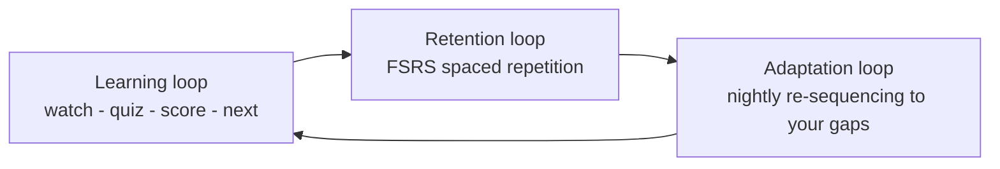
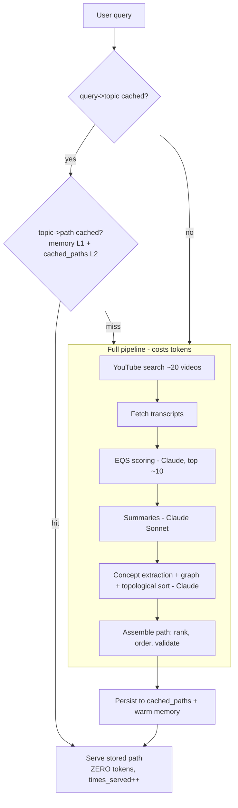

# LearnPath AI — Complete System Overview

> **What this is.** A single, authoritative walkthrough of *everything* that has been
> built — the architecture, the flows, and the logic/algorithms behind each part —
> written so an engineer can implement against it and a non-engineer can still follow
> the story. It ends with a critical list of **what we haven't yet considered but
> should, before the next stage.**
>
> Companion docs: [`docs/SYSTEM_MAP.md`](docs/SYSTEM_MAP.md) (navigation graph),
> [`docs/system-map.html`](docs/system-map.html) (rendered flowcharts), and the
> per-subsystem deep-dives in [`docs/`](docs/). This file is the top-level synthesis.

---

## 1. The 30-second mental model

LearnPath AI turns **"I want to learn X"** into a **structured, quality-scored video
curriculum**, then keeps you learning it with **active recall** and **spaced
repetition**, adapting to your performance over time.

Three loops drive the whole product:



- **Learning loop (minutes):** pick a topic → watch a curated video → answer recall
  questions → mastery updates → next item.
- **Retention loop (days):** every question you answered becomes a spaced-repetition
  card that resurfaces in **Review** on an FSRS schedule.
- **Adaptation loop (weeks):** a nightly job re-tunes your path difficulty/sequence
  from real performance.

A key efficiency principle: **paths are generated once and reused by everyone.** The
expensive AI assembly for a topic is paid for a single time, cached in the database,
and served to every subsequent learner (re-validated, not regenerated, when stale).

---

## 2. Tech stack & topology

```mermaid
flowchart TB
  subgraph Client[Browser / PWA]
    FE[Next.js (Pages Router) + TypeScript + Tailwind\nLeft-sidebar app shell, light/dark/system theme]
  end
  subgraph Vercel
    RW[Next.js rewrites: /api/* -> backend]
  end
  subgraph Railway[Railway - single uvicorn worker]
    API[FastAPI app]
    JOBS[APScheduler cron jobs]
  end
  DB[(PostgreSQL / Supabase)]
  EXT[Claude API · YouTube Data API · Flutterwave]

  FE -->|relative /api/*| RW --> API
  API <--> DB
  API <--> EXT
  JOBS --> DB
  FE <-->|/api/ws WebSocket| API
```

- **Frontend:** Next.js (Pages Router), TypeScript, Tailwind (CSS-variable theming),
  `lucide-react` icons, `recharts`. Deployed on **Vercel**. All API calls are relative
  `/api/*` and proxied server-side by Next rewrites to the backend.
- **Backend:** FastAPI (Python), SQLAlchemy ORM, **single uvicorn worker** on
  **Railway** (Nixpacks). Background work via **APScheduler** in-process.
- **Database:** PostgreSQL (Supabase). Schema is created at boot via
  `Base.metadata.create_all` plus idempotent `ALTER TABLE … ADD COLUMN IF NOT EXISTS`
  patches in `backend/main.py` (no Alembic yet).
- **External:** **Claude** (`anthropic.AsyncAnthropic`, `claude-sonnet-4-6`) for
  scoring/summaries/generation; **YouTube Data API** for video discovery;
  **Flutterwave** for payments.

---

## 3. Repository layout

```
backend/
  main.py            # app startup: schema patches, create_all, router registration, cron jobs
  models.py          # all SQLAlchemy models (one DB)
  schemas.py         # pydantic request/response models
  database.py        # engine/session/Base
  config.py          # settings (env)
  routers/           # thin HTTP layer, one file per domain
  services/          # business logic + algorithms (the brains)
  jobs/              # APScheduler crons (nightly expansion, path adaptation, quiz seed)
  tests/             # pytest (+ conftest that skips when no DB)
frontend/
  pages/             # routes (Pages Router) incl. _app.tsx, _document.tsx
  components/        # ui/ primitives, layout/ shell, feature components
  hooks/             # useAuth, usePWA (PWAProvider), ThemeProvider, useProgress
  lib/               # gitignored helpers (printPdf, useRealtime) — force-added
  styles/globals.css # theme tokens (:root light / .dark)
docs/                # per-subsystem deep dives + this overview's companions
```

---

## 4. Domain glossary (the vocabulary)

| Term | Meaning |
|---|---|
| **EQS** (Educational Quality Score) | 0–100 score of how good a video is for learning, produced by Claude answering ~13 pedagogy questions. **≥65 = confident.** |
| **Topic / Learning path** | An assembled, ordered sequence of quality videos for a query (e.g. "Photosynthesis"). Cached and shared across users. |
| **Concept** | An atomic idea with prerequisites; concepts form a **knowledge graph**. |
| **IRT** (Item Response Theory) | The math behind adaptive quizzing: `P(correct) = 1 / (1 + e^(−1.7·a·(θ−b)))` where θ = learner ability, b = item difficulty. |
| **FSRS** | Free Spaced Repetition Scheduler — the real 19-weight algorithm deciding when a card is reviewed next. |
| **Adaptive path** | A personalized, concept-graph-derived study plan that re-sequences itself from performance. |
| **Mastery** | Per-concept proficiency (`ConceptMastery`), updated by quiz performance. |

---

## 5. Authentication & authorization

### Tokens
- **Login** (`POST /api/auth/login`) returns a short-lived **access token (JWT, 15 min)**
  in the body, and sets a **refresh token (7 days)** as an `httpOnly` cookie.
- Access token lives client-side: **localStorage** (when "Keep me signed in", default on)
  or **sessionStorage**. `hooks/useAuth.tsx` owns this.
- A global axios interceptor catches any `401`, silently calls `POST /api/auth/refresh`
  (using the cookie), retries the original request — so users aren't kicked out every
  15 minutes.
- **Cold-load recovery:** on app boot, if there's no stored access token, the bootstrap
  still tries `/api/auth/refresh` (the 7-day cookie may be valid) and restores the
  session — fixing the "I have to log in every time" problem.

```mermaid
flowchart TD
  S[App loads] --> H{access token in storage?}
  H -- yes --> ME[GET /api/auth/me]
  H -- no --> R[POST /api/auth/refresh\n7-day cookie]
  ME --> OK{valid?}
  OK -- yes --> IN[Signed in]
  OK -- no --> R
  R --> RK{cookie valid?}
  RK -- yes --> P[store new token] --> IN
  RK -- no --> OUT[/auth/login]
  IN -. any later 401 .-> R
```

### Authorization (RBAC)
- `User.role` ∈ `student | teacher | school_admin | admin` (legacy `"user"` == student).
  `admin` is the platform/internal role and is **never self-assigned** — only via
  `ADMIN_EMAILS` (auto-promoted on login) or SQL.
- Role chosen at **signup**; `routers/auth.py:create_user` validates against
  `SELF_SIGNUP_ROLES = {student, teacher, school_admin}`.
- Route gating in `frontend/pages/_app.tsx`: each role lands on its own home
  (`homeForRole`) and is confined to its area (`/admin/*`, `/teacher/*`, `/school/*`);
  wrong-area access bounces to the role's home; the onboarding gate applies to students
  only. Backend enforces with `require_admin` and per-router checks.
- The real auth dependency is `routers/auth.py:get_current_user` (validates JWT, loads
  user, promotes ADMIN_EMAILS, writes a throttled presence heartbeat). A legacy
  `dependencies.py:get_current_user` is a dead Stage-2 placeholder — **don't use it.**

---

## 6. Onboarding (the 6-step learner profile)

`pages/onboarding.tsx` + `services/learner_profile_service.py` (NEW-PACKET-A). Students
are forced here until `onboarding_completed`.

1. **Goal** — IELTS / SAT / WAEC / coding / academic / hobby (multi-select).
2. **Level** — self-assess, or take an adaptive **10-question placement test** (scored
   client-side → beginner/intermediate/advanced).
3. **Deadline + target score** — system computes required **pace** ("you need ~10 hrs/week").
4. **Weekly time + preferred study times.**
5. **Learning styles** — multi-select (video, audio, text, interactive, discussion, visual, groups).
6. **Review & confirm** → marks onboarding complete → **path recommendation**.

**Path-recommendation algorithm (lightweight, no ML):** scores candidate paths by
goal match + level match + timeline fit + learning-style fit + quality/popularity and
returns the **top 3**. Re-profiling is intended quarterly.

---

## 7. The content pipeline — search → learning path (where tokens are spent, once)

`pages/explore.tsx` → `POST /api/search/build-path` → `services/search_service.py`.



### EQS — Educational Quality Score (`services/eqs_service.py`)
Claude answers ~13 pedagogy questions about each video (accuracy, structure, examples,
clarity, pacing, audio, expertise, engagement, retention…), combined into a **0–100**
score. **≥65 = confident**; lower flags the path for remediation. Expanded confidence
scoring (`eqs_expanded_service.py`) adds bonus dimensions.

### Concept graph & ordering
Concepts are extracted from the videos and **topologically sorted** so prerequisites
come first (easy → hard). Path assembly (`path_service.assemble_path`) ranks/orders/
validates the final video sequence.

### The shared, persistent path library (token-saving core)
- Every assembled path is stored once in **`cached_paths`** (`models.py`), keyed by
  `topic_id`, with `query_normalized`, `path_json`, `times_served`, `valid`,
  `last_validated_at`. **`CacheService` is two-layer: memory L1 + DB L2.**
- User B requesting the same topic is served the stored path — **no Claude/YouTube
  tokens** — and it survives Railway restarts (the cache used to be in-memory only,
  which is why it kept re-burning tokens before this was finished).
- **Freshness:** when a stored path is served and is >30 days unvalidated, a **cheap,
  no-Claude re-check** prunes blacklisted videos (keeps stored EQS); only if it drops
  below 3 usable videos is it marked invalid so the next request regenerates.
- **History & dedup UX:** `GET /api/search/lookup` (cheap, no generation) tells the UI
  whether a topic exists / was explored before → Explore shows a **"You've explored
  this before — Continue or Rebuild fresh"** prompt and a **"Recently explored"** list.
  `GET /api/search/history` lists a user's topics (from `SearchEvent`).

### Auto-remediation (`services/remediation_service.py`)
If a built path's average EQS < 60, the user can run a remediation pass:
**Tier 1** Claude Opus suggests alternate query phrasings → re-search → keep the best;
**Tier 2** Gemini does the same (model diversity); **Tier 3** returns the original with a
"best we have" flag. Every tier is budget-guarded by `cost_tracker`.

### Self-building expansion (`services/expansion_service.py`, nightly)
Scans 30 days of `search_events`, clusters queries semantically (Claude), writes
`TopicAlias` dedup rows, finds **popular topics (>10 searches/30d)**, extracts keywords,
and pre-expands them via the branching service — so common topics get richer over time.

### Cost control
`services/cost_tracker.py` charges a named budget (`branching`, `remediation`,
`expansion`, …) before each LLM call and short-circuits when the daily budget is spent.

---

## 8. The learning loop (the player)

`pages/learning/[pathId]/[videoIndex].tsx`.

- **Video player** (`components/Learning/VideoPlayer.tsx`) wraps the YouTube IFrame API
  (custom controls; mounts into a throwaway child + sets `origin` to avoid the
  postMessage console flood; destroys cleanly on unmount).
- **Chapters** (NEW-PACKET-B, `video_chunking_service.py`): a long video is split into
  2–4-minute chunks with AI chapter titles + a learning objective; later chapters can be
  gated behind earlier ones.
- **Active recall** (`docs/ACTIVE_RECALL.md`): after a chunk, an inline quiz appears.
- **Concept sidebar / branches** (`branching_service.py`): a concept can be split into
  3–5 progressive branches (Claude Opus, monotonic difficulty, prerequisite-checked,
  cached 30 days).

### Adaptive quizzing — IRT (`services/quiz_engine_service.py`)
- Each learner has an ability estimate **θ**; each question a difficulty **b**.
- Probability of a correct answer: **`P = 1 / (1 + e^(−1.7·a·(θ−b)))`**.
- The engine selects next questions whose difficulty best matches θ (with some spread
  for variety), updates θ after each response, and updates **`ConceptMastery`**.
- Questions are Claude-generated on demand when the pool for a concept is thin
  (`ensure_questions_for_concept`), with a general-pool fallback.

---

## 9. Retention loop — spaced repetition (FSRS)

`services/fsrs.py` + `pages/review.tsx`.

- Real **FSRS-5** with **19 default weights**. `schedule(stability, difficulty,
  elapsed_days, rating, is_new) → (stability, difficulty, interval)`. Intervals grow
  e.g. 3 → 11 → 35 → 101 → 269 days as recall succeeds.
- Every answered question and every "Add to deck" flashcard (from Notes/Uploads) becomes
  an **`FSRSCard`**. **Review** surfaces today's due cards; grading (Again/Hard/Good/Easy
  → mapped from correct/incorrect) recomputes the next due date.
- (A simpler fixed-interval scheduler — correct `[3,7,30]`, incorrect `[1,3]` — exists in
  `question_service.py` for legacy active-recall; FSRS is the primary engine.)

---

## 10. Adaptive learning paths (NEW-PACKET-H)

`services/adaptive_path_service.py`, `routers/adaptive_paths.py`,
`jobs/path_adaptation.py`. **Distinct from the search→path topic cache** — these are
**per-user**, concept-graph-derived study plans with progress and adaptation.

- **Create:** walk the goal concept's prerequisite chain, skip already-mastered
  concepts, order easy → hard into `PathModule`s.
- **Adapt** (on demand or nightly): from `ModulePerformance`,
  - avg score < ~60% → **difficulty down** (×0.8);
  - avg score > ~80% → **difficulty up** (×1.2);
  - pace far ahead/behind → accelerate / decelerate;
  - weak prerequisite detected → **inject a remediation module**.
- **Nightly cron** (`path_adaptation.py`, 03:30 UTC, `PATH_ADAPTATION_ENABLED`) runs
  `adapt_due_paths` on started paths not adapted in 3 days.
- **Forecast:** simple pace projection → estimated completion date + days ahead/behind.
- `GET /api/adaptive-paths/active` powers the dashboard "Continue learning" (most recent
  incomplete path).

---

## 11. Concept knowledge graph (NEW-PACKET-G)

`services/concept_knowledge_service.py`, `/api/knowledge`, `pages/concepts/*`.
A persistent graph of concepts + relationships, seeded from data the platform already
produces (quiz concepts, mastery, progress). Relationships are inferred from name-token
similarity + difficulty (heuristic; a Claude-based inference path exists for higher
precision). Used for prerequisites, gap detection, "ready to learn?" checks, the visual
SVG concept map (`/concepts/graph`), and as the backbone for adaptive paths. Admin
seeds it via **/admin → Seed graph** (`POST /api/knowledge/seed`).

---

## 12. Exam tracks (NEW-PACKET-I)

`services/exam_track_service.py`, `/api/exams`, `pages/exams*`.
Catalogue of exam-prep tracks (**IELTS / SAT / WAEC**). A user enrolls with a target
score + exam date. **Score prediction** blends recent `QuizSession` scores with
`ConceptMastery`, mapped onto each exam's scale (transparent heuristics, swappable for
official tables), giving a readiness / on-track signal. Includes "Build study path"
(creates a curriculum) and a timed multi-section **mock exam** (`/exams/mock/[trackId]`).

---

## 13. Notes & uploads

- **AI study notes** (NEW-PACKET-D, `study_notes_service.py`, `/api/notes`): turn a video
  into notes in **5 styles** (standard / simple / technical / bullets / mind-map),
  generate flashcards ("Add to deck" → feeds FSRS), export Markdown/Text/PDF
  (browser print).
- **Upload & transform** (NEW-PACKET-E, `content_transformation_service.py`,
  `/api/content`): drop a PDF / image / DOCX / URL → extract text (**OCR via
  tesseract/poppler** for scanned PDFs & images, when installed on Railway) → produce
  an AI explanation, flashcards, related YouTube videos, and a practice quiz.

---

## 14. Social — study buddies & realtime

`services/buddy_service.py`, `/api/buddies`, `routers/realtime.py` (`/api/ws`).
Search/request/accept/decline/remove buddies; presence (online if `last_seen_at` < 5 min,
via a throttled heartbeat in `get_current_user`); 1:1 chat; share notes/uploads. A
WebSocket pushes live presence + messages (`lib/useRealtime.ts`). **Caveat:** the WS
registry is in-memory → assumes a single worker (multi-worker needs Redis pub/sub).

---

## 15. Dashboards by role

- **Learner** (`/dashboard` + `components/Dashboard/LearnerHome.tsx`): real data from
  `/api/dashboard` — streak, today's goal, performance by skill, weekly activity,
  milestones, achievements, buddies, plus stats tiles and a 16-week activity heatmap, and
  a real "Continue learning" CTA.
- **Teacher** (`/teacher/*`): class overview, at-risk students, per-class detail.
- **School admin** (`/school/dashboard`): school-wide analytics (degrades to a no-org
  state if not linked).
- **Platform admin** (`/admin/*`, role=admin): customer success, analytics, EQS
  confidence, blacklist, expansion, seed-graph. (A **platform super-admin** dashboard is
  designed but **not built** — see recommendations.)

---

## 16. Monetization

- **Plans** (`services/subscription_service.py`, NGN): **Free ₦0**, **Pro ₦2,999/mo**,
  **Premium ₦9,999/mo**. Upgrades are immediate + pro-rated; downgrades queue to next
  renewal; `users.tier` is kept in sync so features gate off the User row.
- **Payments** (`services/payment_service.py`): **Flutterwave v3** — hosted checkout,
  verify-by-tx_ref, refund, webhook parse. Safe-by-default: no key → calls raise instead
  of hitting the wire.
- **Usage limits** (`services/usage_tracking_service.py`): derived from event tables
  (`path_sessions`, `question_answers`) — **no counter table**, so limits auto-reset at
  period boundaries and can't be faked client-side.
- **Free tier & feature gates** (`free_tier_service.py`): single source-of-truth feature
  map; backend routes + frontend locks both read it.
- **Growth** (`referral_service.py`, `loyalty_service.py`): referral = ₦500/successful
  signup (cap ₦5,000/mo, auto-resets monthly); loyalty = points + tiers based on
  always-increasing `lifetime_points`. *(Credit application at checkout is deferred to
  full Flutterwave discount integration.)*

---

## 17. B2B (schools)

`organization_service.py`, `teacher_service.py`, `schools.py`, `customer_success_service.py`.
**School tiers:** Starter (₦50k/$35), Growth (₦150k/$100), Enterprise (custom). Orgs have
teachers, classes, students; a **customer-success** engine scores org health (engagement /
progress / activity → healthy / at-risk / churning) and surfaces churn risks + outreach in
the admin dashboard.

---

## 18. Cross-cutting systems

- **Quality & safety:** **blacklist** (`blacklist_service.py`, soft/hard, auto-blacklist
  low EQS, shadow-testing), **confidence** dashboards, **remediation**, **self-building
  expansion**, **cost guardrails**.
- **PWA / offline** (`public/sw.js`, `hooks/usePWA.ts`): service worker (network-only for
  `/api` GETs, cache-first for static, bypass non-GET), offline indicator, install prompt,
  background sync queues. **Single registration** via `PWAProvider`.
- **Theming** (`hooks/ThemeProvider.tsx`, `_document.tsx`): light / dark / system,
  CSS-variable tokens, no-flash inline script, Topbar toggle.
- **i18n** (`docs/INTERNATIONALIZATION.md`) and **accessibility** (`components/Accessibility/*`,
  `docs/WCAG_COMPLIANCE.md`) scaffolding exists.
- **Analytics** (`analytics_service.py`, `/api/analytics`): revenue/cohort/usage for admin.

---

## 19. Data model (the important tables)

`User`, `UserProfile` · `Topic`, `Video`, `SearchEvent`, `TopicAlias`, **`CachedPath`** ·
`QuizSession`, `QuizQuestion`, `QuizResponse`, `ConceptMastery`, `FSRSCard` ·
`Concept`, `ConceptRelationship` · `AdaptivePath`, `PathModule`, `ModulePerformance`,
`PathAdaptation` · `StudyNote`, `NoteFlashcard`, `UserUpload`, `ContentTransformation` ·
`ExamTrack`, `ExamEnrollment`, `MockExamAttempt` · `BuddyConnection`, `SharedItem`,
`BuddyMessage` · `UserStreak`, `UserAchievement` · `Subscription`, `Transaction`,
`Organization`, `Teacher`, `OrganizationSubscription`. All in one PostgreSQL DB; created
via `create_all` + idempotent column patches at boot.

---

## 20. Background jobs (APScheduler, in-process)

| Job | Schedule | What |
|---|---|---|
| `jobs/path_adaptation.py` | daily 03:30 UTC | re-adapt started adaptive paths |
| `jobs/nightly_expansion.py` | nightly | dedup queries, expand popular topics |
| `jobs/quiz_seed.py` | boot | seed an initial quiz question pool |

Plus boot-time tasks in `main.py`: schema patches, `create_all`, ADMIN_EMAILS promotion.

---

## 21. API surface (routers)

| Prefix | Domain |
|---|---|
| `/api/auth`, `/api/sessions` | auth, session |
| `/api/search`, `/api/path` | search → path, **cache library, lookup, history** |
| `/api/youtube`, `/api/summary`, `/api/eqs`, `/api/eqs/expanded`, `/api/branching` | content pipeline |
| `/api/quiz`, `/api/questions`, `/api/progress` | quizzes, recall, mastery, progress |
| `/api/knowledge`, `/api/concepts` | concept graph (new) / legacy extractor |
| `/api/adaptive-paths`, `/api/exams` | adaptive paths, exam tracks |
| `/api/notes`, `/api/content`, `/api/chunks` | notes, uploads, video chunks |
| `/api/buddies`, `/api/ws` | social, realtime |
| `/api/dashboard`, `/api/learner` | dashboards, onboarding |
| `/api/remediation`, `/api/expansion`, `/api/blacklist`, `/api/cache` | quality/self-building |
| `/api/subscriptions`, `/api/payments`, `/api/usage`, `/api/free-tier`, `/api/features` | monetization |
| `/api/referral`, `/api/loyalty`, `/api/analytics` | growth, analytics |
| `/api/organizations`, `/api/teachers`, `/api/schools`, `/api/admin/customer-success` | B2B + internal admin |

---

## 22. Environment & deployment notes (operational truth)

- **`NEXT_PUBLIC_API_URL` (Vercel)** must point at the Railway **https** backend. It is
  inlined at build time; if left at the dev default the live app calls `localhost`. The
  code self-heals http→https and skips localhost probes, but the rewrite still needs the
  right value.
- **Railway no-cache rebuild** required to install `tesseract` + `poppler` for OCR
  (scanned-PDF/image uploads); until then OCR returns a graceful "unavailable" message.
- **Keys:** `CLAUDE_API_KEY`, `YOUTUBE_API_KEY` (Railway); `FLUTTERWAVE_SECRET_KEY` for
  live payments; optional `RESEND_API_KEY`/`SENDGRID_API_KEY` for email.
- **First admin:** set `ADMIN_EMAILS` (auto-promoted on login) or `UPDATE users SET
  role='admin'`.
- New tables/columns **auto-create on boot** — no manual migration for those.

---

## 23. Known limitations / deferred (already on the ledger)

- Platform **super-admin** dashboard (global metrics, MRR/churn, content mgmt, moderation)
  — designed, not built.
- **Multi-worker scaling:** the in-memory pieces (cache L1, `cost_tracker`,
  rate-limiter, WebSocket registry) are process-local → need Redis when scaling past one
  worker. (The path cache itself is now DB-backed.)
- Referral/loyalty **credit application at checkout** deferred to full Flutterwave
  discount integration.
- Exam **question banks / official conversion tables** are heuristic/placeholder content.
- A few legacy components (PWA prompt, dead LanguageSwitcher) aren't fully theme-aware.

---

## 24. Recommendations — crucial things we haven't fully considered

Ordered by how much they'd hurt if skipped before the next stage.

### A. Production safety & correctness (do first)
1. **Database migrations (Alembic).** Today the schema is `create_all` + ad-hoc
   `ALTER … IF NOT EXISTS` patches. That cannot do renames, type changes, backfills, or
   safe rollbacks. Adopt Alembic before the schema grows further — this is the biggest
   latent risk.
2. **Error monitoring + structured logging** (Sentry or similar). Right now a failure in
   prod is invisible unless someone reads Railway logs. Add request IDs and alerting.
3. **Payment integrity:** webhook **idempotency** + signature verification + a
   reconciliation job. Money flows must be exactly-once and auditable.
4. **Auth hardening:** refresh-token **rotation + revocation/denylist** (logout should
   invalidate server-side), confirm the **forgot-password** flow is actually implemented
   end-to-end, and verify CORS/cookie `SameSite`/`Secure` across the Vercel↔Railway split.
5. **Secrets & the JWT trap:** the app has a history of `JWT_SECRET_KEY` vs `JWT_SECRET`
   startup mismatches — document the canonical names and add a fail-fast config validator.

### B. Cost & abuse control (you're paying per token)
6. **Per-user / per-day AI spend caps** beyond the global `cost_tracker` budget, and
   abuse throttling on generation endpoints (the shared cache helps, but a novel-query
   flood still costs money).
7. **Prompt-injection / output validation** for anything Claude generates that's shown to
   users or stored, especially uploaded-content transforms.
8. **A cost/usage dashboard** surfacing `cost_tracker` spend and cache **hit-rate /
   `times_served`** so you can see the token savings and catch runaway spend.

### C. Legal / compliance (blocking for real users, esp. Nigeria + minors)
9. **Privacy policy, Terms, and NDPR/GDPR** data-subject rights: the Settings page
   references "download my data" / "delete account" — make those actually work
   (export + hard delete).
10. **YouTube ToS / content licensing:** confirm embedding + storing
    transcripts/summaries is within YouTube's terms; have a takedown/availability path
    (the freshness re-check only prunes blacklisted, not removed, videos).
11. **Minors / education data:** if students can be under-18 (WAEC/SAT audiences),
    consider parental-consent and stricter data handling.

### D. Quality & trust
12. **Automated test coverage** for the new systems (auth refresh, the shared path cache,
    FSRS scheduling, IRT, payments) and CI gates — there are tests, but the recent
    features landed largely unverified by tests.
13. **Real content depth:** exam question banks, verified curricula, and a human-review
    path for AI-generated questions/notes before they're presented as authoritative.
14. **YouTube availability re-check** (true "video removed/privated" detection), not just
    blacklist pruning, so cached paths don't silently contain dead videos.

### E. Growth & product
15. **Transactional email actually wired** (trial/upgrade/at-risk nudges) — the service
    exists but needs keys + triggers.
16. **Activation & retention analytics** (funnels: signup → onboarding → first path →
    first review → week-2 return) to know whether the loops actually retain.
17. **The super-admin platform dashboard** (global health/revenue/moderation) before you
    onboard real schools at scale.
18. **Mobile:** ship the PWA to stores or commit to installable-PWA polish; verify the
    learning player + offline flows on real devices.

> **Suggested sequencing:** A (safety) → B (cost) → C (legal) in parallel with finishing
> the super-admin + email, then D/E as you push toward real users. Items A1 (Alembic),
> A3 (payment idempotency), and C9 (data rights) are the ones most likely to bite hard if
> deferred.
